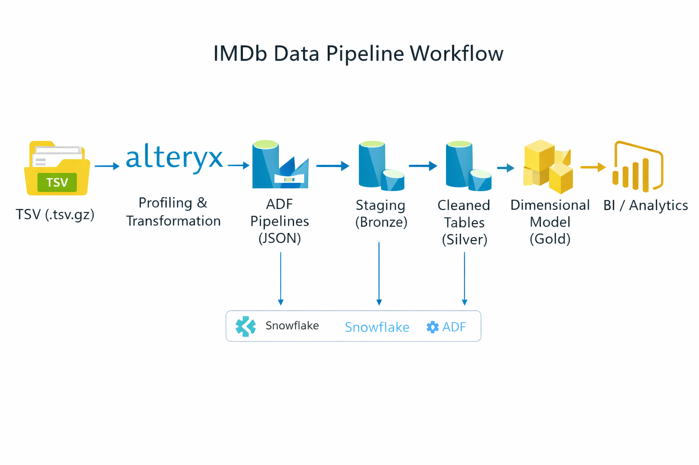
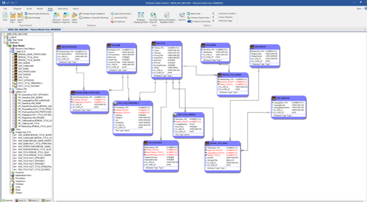
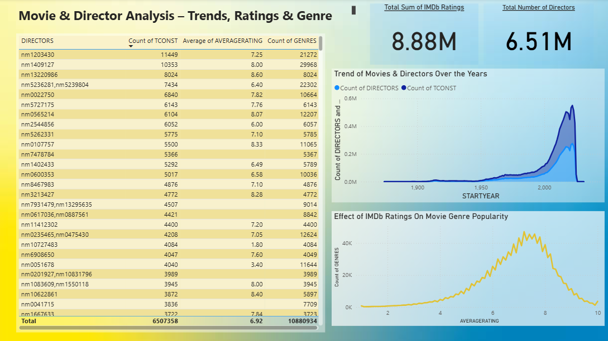
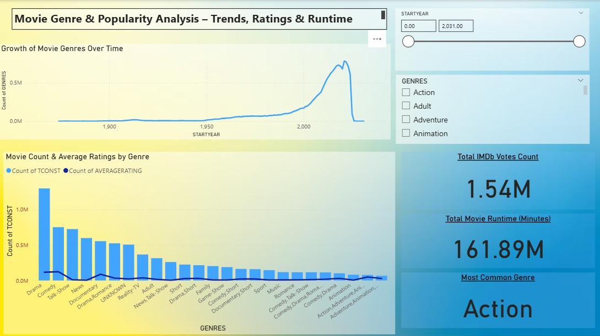
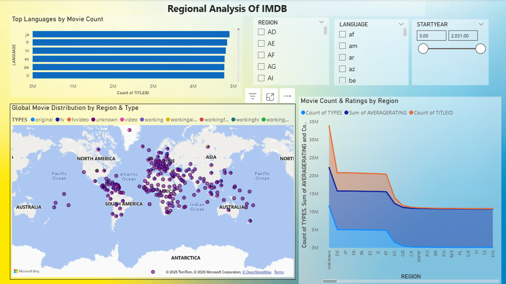

# 🎬 IMDb Data Engineering Pipeline

**Technologies:** Alteryx • Azure Data Factory • Snowflake • Power BI

An end-to-end data engineering and analytics pipeline processing **200M+ IMDb records** through a layered architecture (Bronze → Silver → Gold) to demonstrate production-grade data profiling, orchestration, dimensional modeling, and analytics validation.

---

## 📌 Project Overview

This project addresses real-world data engineering challenges in the IMDb public datasets:

- **Profiled and cleaned** 6 semi-structured IMDb datasets using Alteryx
- **Orchestrated** multi-stage ETL pipelines with Azure Data Factory
- **Designed** star schema with bridge tables in Snowflake
- **Validated** dimensional model accuracy through targeted analytics dashboards

---

## 🧠 Design Philosophy

**Right tool for the right job:**

- **Alteryx** — Dataset-level profiling and quality remediation
- **Azure Data Factory** — Pipeline orchestration and layer transitions
- **Snowflake** — Scalable analytical warehouse with dimensional modeling
- **Power BI** — Gold-layer validation and analytics

---

## 📦 Source Datasets

IMDb public datasets (UTF-8 encoded, TSV format, gzip-compressed):

- `title.akas.tsv.gz` — Alternative titles and regional variants
- `title.crew.tsv.gz` — Directors and writers
- `title.episode.tsv.gz` — TV series episode information
- `title.principals.tsv.gz` — Cast and crew details
- `name.basics.tsv.gz` — Person metadata

**Note:** Missing values represented as `\N`

---

## 🏗️ Architecture

### Data Flow
```
IMDb TSV Files (200M+ records)
    ↓
Alteryx (Profiling & Cleaning)
    ↓
Azure Data Factory (Orchestration & Joins)
    ↓
Snowflake Bronze Layer (Raw ingestion)
    ↓
Snowflake Silver Layer (Standardized tables)
    ↓
Snowflake Gold Layer (Dimensional model)
    ↓
Power BI (Analytics validation)
```



---

## 🧹 Data Quality & Profiling

### Alteryx Workflows

Six dedicated Alteryx workflows for data profiling and cleaning:

- `CREW_CLEAN.yxmd` — Directors and writers cleanup
- `EPISODES_CLEAN.yxmd` — Episode data standardization
- `NAME_BASIC_CLEAN.yxmd` — Person metadata remediation
- `PRINCIPALS_CLEAN.yxmd` — Cast and crew data quality
- `TITLE_AKAS.yxmd` — Alternative titles normalization
- `TITLE_NAME_CLEAN.yxmd` — Title metadata cleanup

**Data Quality Remediation:**
- Null value standardization (`\N` → proper NULL handling)
- Whitespace trimming and text normalization
- UTF-8 encoding corrections
- Unescaped quote remediation
- Data type validation and casting
- Duplicate detection and resolution

**Location:** `alteryx/`

---

## 🔄 Pipeline Orchestration

### Azure Data Factory Components

All ADF assets are version-controlled as JSON (Infrastructure-as-Code):

- **Pipelines** — End-to-end orchestration logic
- **Dataflows** — Transformation and join operations
- **Datasets** — Source and sink definitions
- **Linked Services** — Connection configurations

**Key Capabilities:**
- Automated Bronze → Silver → Gold layer transitions
- Complex multi-dataset joins
- Incremental load patterns
- Error handling and logging

**Location:** `pipeline/`, `dataflow/`, `dataset/`, `linkedService/`

---

## 🗄️ Dimensional Model (Gold Layer)

### Star Schema Design

**Dimension Tables:**
- `dim_titles` — Title metadata and attributes
- `dim_names` — People (actors, directors, writers)
- `dim_genres` — Genre taxonomy
- `dim_regions` — Geographic regions
- `dim_languages` — Language codes
- `dim_professions` — Professional roles

**Bridge Tables (Many-to-Many):**
- `bridge_title_genre` — Handles multi-genre titles
- `bridge_title_akas` — Regional title variants
- `bridge_name_profession` — Multiple professions per person

**Fact Tables:**
- `fact_title_ratings` — Ratings and vote counts
- `fact_title_principals` — Cast and crew assignments
- `fact_episodes` — TV series episode relationships



---

## 📊 Analytics Validation

Validation dashboards confirm dimensional model correctness:

### 1. Movie & Director Analysis
**Validates:** Title-to-director joins, rating aggregations  


### 2. Genre Popularity Analysis
**Validates:** Bridge table functionality, many-to-many genre relationships  


### 3. Regional Title Distribution
**Validates:** Geographic and language-based aggregations  


---

## 📁 Repository Structure
```
IMDB_PROJECT/
├── pipeline/                 # ADF pipeline definitions (JSON)
├── dataset/                  # ADF dataset configurations
├── dataflow/                 # ADF dataflow transformations
├── linkedService/            # ADF connection configurations
├── alteryx/                  # Data profiling workflows (.yxmd)
│   ├── CREW_CLEAN.yxmd
│   ├── EPISODES_CLEAN.yxmd
│   ├── NAME_BASIC_CLEAN.yxmd
│   ├── PRINCIPALS_CLEAN.yxmd
│   ├── TITLE_AKAS.yxmd
│   └── TITLE_NAME_CLEAN.yxmd
├── snowflake/                # DDL scripts and validation queries
├── docs/
│   ├── architecture/         # System architecture diagrams
│   ├── modeling/             # Dimensional model documentation
│   ├── dashboards/           # Validation dashboard screenshots
│   └── cleaning/             # Data quality reports
└── README.md
```

---

## 🚀 Reproduction Steps

1. **Download** IMDb public datasets from [datasets.imdbws.com](https://datasets.imdbws.com/)
2. **Profile and clean** datasets using Alteryx workflows
3. **Configure** ADF linked services (Azure Blob Storage, Snowflake)
4. **Execute** ADF pipelines to populate Bronze layer
5. **Run** Silver layer transformations via ADF dataflows
6. **Build** Gold layer dimensional model in Snowflake
7. **Validate** with Power BI dashboards and SQL queries

**Note:** Connection strings and credentials are excluded from this repository.

---

## 🛠️ Technology Stack

| Component | Technology |
|-----------|-----------|
| Data Profiling & Cleaning | Alteryx Designer |
| Orchestration & ETL | Azure Data Factory |
| Data Warehouse | Snowflake |
| Dimensional Modeling | ER/Studio Data Architect |
| Analytics & Validation | Power BI Desktop |
| Version Control | Git |

---

## 📚 Documentation

- **[Data Quality Report](docs/cleaning/)** — Profiling findings, anomalies, and remediation strategies
- **[Dimensional Model Guide](docs/modeling/)** — Star schema design rationale and entity relationships

---

## 💡 Key Takeaways

This project demonstrates:

- ✅ Handling large-scale, semi-structured datasets with real-world quality issues
- ✅ Implementing modern medallion architecture (Bronze/Silver/Gold)
- ✅ Designing analytics-optimized dimensional models
- ✅ Building production-grade orchestration pipelines
- ✅ Infrastructure-as-Code approach to data engineering

**Ideal for:** Data Engineer, Analytics Engineer, BI Engineer roles requiring hands-on experience with cloud data warehousing and dimensional modeling.

---

## 📧 Contact

**Ganesh** | [LinkedIn](your-linkedin-url) | [Email](your-email)

*This project showcases practical data engineering skills and is available for technical discussion.*